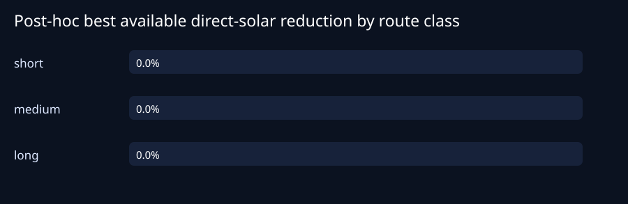
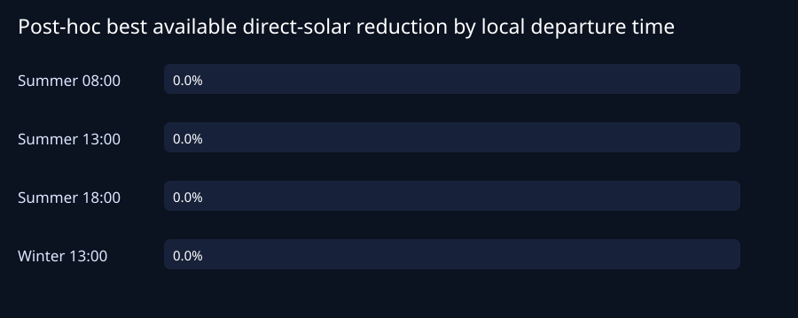
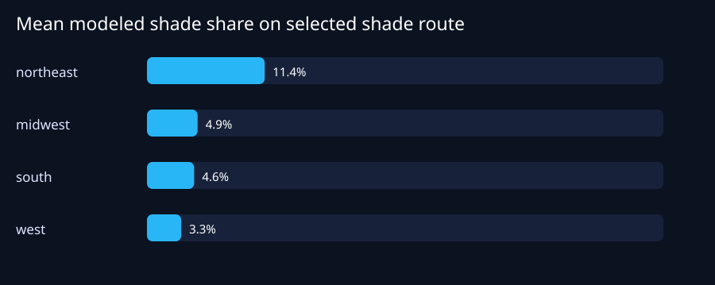
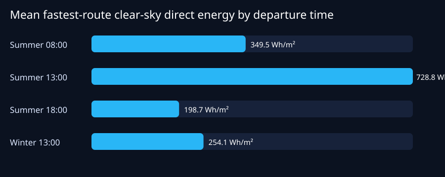

# U.S. clear-sky shade-aware route simulation

Generated: 2026-08-21T21:08:59.184Z

## 초록

미국 4개 장면 데이터 권역에서 단·중·장거리 12개 출발지–목적지 조합을 선정하고, 각 경로를 2026년 하지의 08:00·13:00·18:00 및 동지의 13:00 현지시각에 분석하여 총 48개 사례를 만들었다. 후보는 앱과 같은 라우터 흐름(직접 OSRM 대안, 필요할 때 최대 2개의 측면 경유점 요청, 형상 중복 제거, 최단시간 대비 60% 초과 후보 제외)으로 수집하고 네 시각에 재사용했다. 구간별 태양 위치는 NREL SPA, 맑은하늘 광대역 일사는 Bird 모델, 건물·터널·지형 차광은 사전계산 OSM/SRTM 장면으로 계산했다. 제품의 우회·최소개선 정책을 적용한 그늘 경로의 빠른 경로 대비 총 직접 일사 감소율은 평균 **0.0%**였다. 제한된 후보를 사후적으로 모두 비교한 최대 가능 감소율은 평균 **0.0%**였고, 전체 주행시간 중 장면이 확정한 평균 차광시간 비율은 **6.0%**, 전체 경로 중 차광 판정 불확실 시간은 평균 **3.0%**였다. 12개 OD 중 앱 흐름을 거친 뒤에도 후보가 하나뿐인 OD는 0개였다. 0% 감소는 계산 실패를 뜻하지 않으며, 최단 경로가 최선이거나 대안이 제품의 우회·최소개선 기준을 통과하지 못할 때 발생한다. 실제 UV 선량, 실내온도, 연료·배터리 절감 또는 의학적 효과는 추정하지 않았다.

## Abstract

This reproducible simulation evaluated 12 U.S. origin–destination pairs (short, medium and long routes in four release regions) at four local departure times, yielding 48 route-time cases. Candidate collection used the production app's direct-plus-via OSRM flow and reused the resulting geometry across times. NREL SPA determined segment solar position; the Bird clear-sky model estimated broadband irradiance; precomputed OpenStreetMap/SRTM scenes tested building, tunnel and terrain occlusion. Under the product's detour/improvement policy, the selected shade route reduced modeled direct-solar energy by a mean of **0.0%**. A separate post-hoc best-available analysis found **0.0%** mean potential among the limited returned candidates; it is not a navigation recommendation. Mean confirmed shade time over total driving time was **6.0%**, while mean uncertain-occlusion time over the whole route was **3.0%**. These are clear-sky model estimates, not measured UV dose, cabin temperature, fuel economy or medical protection.

## Methods

### Route and time design

Twelve fixed routes covered Northeast, Midwest, South and West releases, with one short, medium and long trip per region. Departures were 08:00, 13:00 and 18:00 local time on 21 June 2026 and 13:00 local time on 21 December 2026. Candidate collection calls the production router: it first requests direct OSRM alternatives, and when fewer than three geometrically distinct direct routes exist, it makes at most two bounded lateral via-point requests. The production geometry de-duplication and 1.60× fastest-duration ceiling are retained. The resulting 2–4 candidates per OD are cached in [us-route-candidates.json](data/us-route-candidates.json) and reused at all four times. This is app-equivalent candidate generation, but public OSRM still does not enumerate every drivable route.

### Solar and occlusion model

For segment (i), NREL SPA computes solar zenith and azimuth at its predicted pass time. The Bird clear-sky model supplies direct-normal irradiance (DNI_i). Scene occlusion (O_i) equals one when the 2.5D model identifies a building, terrain horizon or tunnel obstruction and zero otherwise. Direct horizontal energy is integrated over travel time:

$$H_{dir}=\sum_i DNI_i\max(0,\cos z_i)(1-O_i)\frac{\Delta t_i}{3600}\quad[Wh/m^2]$$

The same-tier fastest route is the baseline. Reduction is (100(1-H_{shade}/H_{fastest})). Bird inputs use a declared standard clear-sky atmosphere (ozone 0.30 cm, precipitable water 1.5 cm, AOD 0.10/0.08, albedo 0.20), not actual clouds, smoke or local weather.

### Scene uncertainty

Release inputs used in this run: northeast: scene-us-northeast-hybrid-v3 (schema 3), midwest: scene-us-midwest-hybrid-v3 (schema 3), south: scene-us-south-hybrid-v3 (schema 3), west: scene-us-west-hybrid-v3 (schema 3). Schema-v3 scenes preserve building-height provenance and sensitivity envelopes and apply a ±10 m terrain relative-vertical-error test at the stated 90% level. A building or terrain obstruction receives shade credit only when it remains blocking under the conservative bound. A marginal result is marked `uncertain`; its occlusion ratio is null and the energy integral above uses (O_i=0), so uncertainty never creates an artificial solar-reduction benefit. 4 of 4 releases in this run used schema v3. Building envelopes are sensitivity bounds, not statistical confidence intervals.

### GPS and ETA scope

The simulation assigns segment pass times from OSRM step durations scaled to the route duration. It does not replay phone GPS fixes, traffic, rerouting latency or Android lifecycle interruptions. In the app, the W3C Geolocation `accuracy` value is treated separately as a 95% horizontal-position radius and propagated only as a GPS-position contribution to ETA; it is not a confidence interval for traffic or the OSRM travel-time estimate.

### UV interpretation

The study does **not** report UV Index or erythemal UV dose. Those require spectral irradiance, action-spectrum weighting, clouds/aerosols and occupant exposure geometry. The reported direct-solar reduction can only be interpreted as a broadband direct-beam occlusion proxy; diffuse UV remains even in shade.

### Cooling-energy sensitivity

Avoided incident direct energy was converted only to a sensitivity range, not a vehicle claim: effective coupled area 1.5–3.0 m², solar coupling 0.35–0.65 and cooling COP 2.0–3.5. Thus \(E_{cool}=H_{avoided}A\eta/COP\). Vehicle glazing, body absorptance, ventilation, ambient temperature, HVAC control and occupancy were not simulated, so cabin-temperature reduction cannot be inferred.

### Runtime and data transfer

The complete 48-case run took **149.6 s** (3.12 s/case) on the development PC while reading validated release assets from local disk. The Node harness has no Android IndexedDB, and therefore read **1535.2 MiB** across all repeated time cases. This is a stress measurement of the analysis/data path, not a phone-network benchmark; Android persistent tile cache can avoid later network transfers, while a first long trip can still require tens of MiB.

## Results

| Case | Local departure | km | tier | fastest direct | selected shade direct | selected reduction | post-hoc best | confirmed shade | uncertain occlusion | selected detour min | post-hoc cooling range |
|:--|:--|--:|:--|--:|--:|--:|--:|--:|--:|--:|--:|
| NE-S | Summer 08:00 | 4.5 | scene | 49.6 | 49.6 | 0.0% | 0.0% | 19.0% | 16.6% | 0.0 | 0.0–0.0 Wh |
| NE-S | Summer 13:00 | 4.5 | scene | 122.4 | 122.4 | 0.0% | 0.0% | 10.3% | 2.4% | 0.0 | 0.0–0.0 Wh |
| NE-S | Summer 18:00 | 4.5 | scene | 36.0 | 36.0 | 0.0% | 0.0% | 19.0% | 32.3% | 0.0 | 0.0–0.0 Wh |
| NE-S | Winter 13:00 | 4.5 | scene | 35.8 | 35.8 | 0.0% | 0.0% | 17.9% | 19.7% | 0.0 | 0.0–0.0 Wh |
| NE-M | Summer 08:00 | 24.7 | scene | 170.9 | 170.9 | 0.0% | 0.0% | 13.8% | 1.2% | 0.0 | 0.0–0.0 Wh |
| NE-M | Summer 13:00 | 24.7 | scene | 349.4 | 349.4 | 0.0% | 0.0% | 13.8% | 0.0% | 0.0 | 0.0–0.0 Wh |
| NE-M | Summer 18:00 | 24.7 | scene | 105.3 | 105.3 | 0.0% | 0.0% | 11.0% | 2.0% | 0.0 | 0.0–0.0 Wh |
| NE-M | Winter 13:00 | 24.7 | scene | 109.6 | 109.6 | 0.0% | 0.0% | 11.4% | 3.8% | 0.0 | 0.0–0.0 Wh |
| NE-L | Summer 08:00 | 81.1 | scene | 521.5 | 521.5 | 0.0% | 0.0% | 5.3% | 0.1% | 0.0 | 0.0–0.0 Wh |
| NE-L | Summer 13:00 | 81.1 | scene | 936.5 | 936.5 | 0.0% | 0.0% | 5.2% | 0.0% | 0.0 | 0.0–0.0 Wh |
| NE-L | Summer 18:00 | 81.1 | scene | 215.4 | 215.4 | 0.0% | 0.0% | 5.2% | 1.1% | 0.0 | 0.0–0.0 Wh |
| NE-L | Winter 13:00 | 81.1 | scene | 265.0 | 265.0 | 0.0% | 0.0% | 5.2% | 0.3% | 0.0 | 0.0–0.0 Wh |
| MW-S | Summer 08:00 | 12.8 | hybrid-scene | 100.3 | 100.3 | 0.0% | 0.0% | 4.1% | 1.7% | 0.0 | 0.0–0.0 Wh |
| MW-S | Summer 13:00 | 12.8 | scene | 229.5 | 229.5 | 0.0% | 0.0% | 3.8% | 0.0% | 0.0 | 0.0–0.0 Wh |
| MW-S | Summer 18:00 | 12.8 | scene | 70.1 | 70.1 | 0.0% | 0.0% | 10.9% | 9.9% | 0.0 | 0.0–0.0 Wh |
| MW-S | Winter 13:00 | 12.8 | scene | 71.4 | 71.4 | 0.0% | 0.0% | 9.6% | 10.6% | 0.0 | 0.0–0.0 Wh |
| MW-M | Summer 08:00 | 67.0 | scene | 410.2 | 410.2 | 0.0% | 0.0% | 3.5% | 0.3% | 0.0 | 0.0–0.0 Wh |
| MW-M | Summer 13:00 | 67.0 | scene | 809.2 | 809.2 | 0.0% | 0.0% | 3.5% | 0.0% | 0.0 | 0.0–0.0 Wh |
| MW-M | Summer 18:00 | 67.0 | scene | 218.4 | 218.4 | 0.0% | 0.0% | 3.6% | 0.3% | 0.0 | 0.0–0.0 Wh |
| MW-M | Winter 13:00 | 67.0 | scene | 247.5 | 247.5 | 0.0% | 0.0% | 3.8% | 1.1% | 0.0 | 0.0–0.0 Wh |
| MW-L | Summer 08:00 | 143.1 | hybrid-scene | 931.4 | 931.4 | 0.0% | 0.0% | 3.9% | 0.0% | 0.0 | 0.0–0.0 Wh |
| MW-L | Summer 13:00 | 143.1 | scene | 1522.2 | 1522.2 | 0.0% | 0.0% | 3.9% | 0.0% | 0.0 | 0.0–0.0 Wh |
| MW-L | Summer 18:00 | 143.1 | scene | 297.7 | 297.7 | 0.0% | 0.0% | 4.0% | 0.2% | 0.0 | 0.0–0.0 Wh |
| MW-L | Winter 13:00 | 143.1 | scene | 387.7 | 387.7 | 0.0% | 0.0% | 4.2% | 0.4% | 0.0 | 0.0–0.0 Wh |
| SO-S | Summer 08:00 | 10.1 | scene | 42.4 | 42.4 | 0.0% | 0.0% | 12.2% | 12.9% | 0.0 | 0.0–0.0 Wh |
| SO-S | Summer 13:00 | 10.1 | scene | 183.0 | 183.0 | 0.0% | 0.0% | 12.2% | 0.5% | 0.0 | 0.0–0.0 Wh |
| SO-S | Summer 18:00 | 10.1 | scene | 83.7 | 83.7 | 0.0% | 0.0% | 12.6% | 4.6% | 0.0 | 0.0–0.0 Wh |
| SO-S | Winter 13:00 | 10.1 | scene | 93.0 | 93.0 | 0.0% | 0.0% | 12.2% | 4.7% | 0.0 | 0.0–0.0 Wh |
| SO-M | Summer 08:00 | 51.6 | scene | 183.8 | 183.8 | 0.0% | 0.0% | 1.4% | 0.1% | 0.0 | 0.0–0.0 Wh |
| SO-M | Summer 13:00 | 51.6 | scene | 608.5 | 608.5 | 0.0% | 0.0% | 1.4% | 0.0% | 0.0 | 0.0–0.0 Wh |
| SO-M | Summer 18:00 | 51.6 | scene | 226.6 | 226.6 | 0.0% | 0.0% | 1.5% | 2.2% | 0.0 | 0.0–0.0 Wh |
| SO-M | Winter 13:00 | 51.6 | scene | 305.5 | 305.5 | 0.0% | 0.0% | 1.4% | 0.0% | 0.0 | 0.0–0.0 Wh |
| SO-L | Summer 08:00 | 134.5 | scene | 565.8 | 565.8 | 0.0% | 0.0% | 0.0% | 0.0% | 0.0 | 0.0–0.0 Wh |
| SO-L | Summer 13:00 | 134.5 | scene | 1490.2 | 1490.2 | 0.0% | 0.0% | 0.0% | 0.0% | 0.0 | 0.0–0.0 Wh |
| SO-L | Summer 18:00 | 134.5 | scene | 455.5 | 455.5 | 0.0% | 0.0% | 0.0% | 0.5% | 0.0 | 0.0–0.0 Wh |
| SO-L | Winter 13:00 | 134.5 | scene | 698.1 | 698.1 | 0.0% | 0.0% | 0.0% | 0.2% | 0.0 | 0.0–0.0 Wh |
| WE-S | Summer 08:00 | 25.4 | scene | 120.8 | 120.8 | 0.0% | 0.0% | 6.9% | 1.9% | 0.0 | 0.0–0.0 Wh |
| WE-S | Summer 13:00 | 25.4 | hybrid-scene | 307.0 | 307.0 | 0.0% | 0.0% | 5.7% | 0.0% | 0.0 | 0.0–0.0 Wh |
| WE-S | Summer 18:00 | 25.4 | scene | 85.9 | 85.9 | 0.0% | 0.0% | 8.5% | 6.5% | 0.0 | 0.0–0.0 Wh |
| WE-S | Winter 13:00 | 25.4 | hybrid-scene | 139.3 | 139.3 | 0.0% | 0.0% | 5.7% | 0.7% | 0.0 | 0.0–0.0 Wh |
| WE-M | Summer 08:00 | 54.1 | scene | 283.7 | 283.7 | 0.0% | 0.0% | 2.2% | 0.3% | 0.0 | 0.0–0.0 Wh |
| WE-M | Summer 13:00 | 54.1 | scene | 626.7 | 626.7 | 0.0% | 0.0% | 1.9% | 0.0% | 0.0 | 0.0–0.0 Wh |
| WE-M | Summer 18:00 | 54.1 | scene | 237.2 | 237.2 | 0.0% | 0.0% | 1.8% | 0.2% | 0.0 | 0.0–0.0 Wh |
| WE-M | Winter 13:00 | 54.1 | scene | 153.1 | 153.1 | 0.0% | 0.0% | 1.9% | 2.6% | 0.0 | 0.0–0.0 Wh |
| WE-L | Summer 08:00 | 140.6 | scene | 814.0 | 814.0 | 0.0% | 0.0% | 1.3% | 0.0% | 0.0 | 0.0–0.0 Wh |
| WE-L | Summer 13:00 | 140.6 | scene | 1560.7 | 1560.7 | 0.0% | 0.0% | 1.1% | 0.0% | 0.0 | 0.0–0.0 Wh |
| WE-L | Summer 18:00 | 140.6 | scene | 352.3 | 352.3 | 0.0% | 0.0% | 1.6% | 0.4% | 0.0 | 0.0–0.0 Wh |
| WE-L | Winter 13:00 | 140.6 | scene | 543.4 | 543.4 | 0.0% | 0.0% | 1.2% | 0.0% | 0.0 | 0.0–0.0 Wh |

Direct-energy columns are Wh/m². “Post-hoc best” selects the lowest-energy same-tier OSRM candidate within a 35% duration bound after seeing all outcomes; it is diagnostic and not a navigation recommendation. Cooling-equivalent values are Wh per trip for that post-hoc opportunity under the sensitivity assumptions above. Zero selected reduction commonly means the fastest route was also the best admissible route or no alternative passed the product gates.

## Limitations

- This is a deterministic model study, not a randomized field trial.
- OSM buildings can be missing and inferred heights are uncertain; SRTM and 5 km scene preprocessing have finite resolution.
- Trees, temporary structures, bridge decks, clouds, road-side lane position and vehicle-body self-shading are incomplete or absent.
- Public OSRM direct and via requests do not enumerate every drivable route.
- GPS error, traffic and live ETA prediction error are outside this simulation.
- The cooling sensitivity is not an estimate of actual battery/fuel savings for a specific vehicle.
- Results do not establish medical benefit or safe UV exposure.

## Reproduction

`npm run simulate:us` uses the four validated local release directories and reads each release tag/schema from its manifest. Override them with `SCENE_NE_DIR`, `SCENE_MW_DIR`, `SCENE_SOUTH_DIR` and `SCENE_WEST_DIR`. The first run may call public OSRM for the app-equivalent direct-plus-via candidate set; subsequent runs reuse the candidate cache. Machine-readable results are in [CSV](data/us-solar-route-simulation.csv) and [JSON](data/us-solar-route-simulation.json).

## References

1. Reda I, Andreas A. [Solar Position Algorithm for Solar Radiation Applications](https://doi.org/10.2172/15003974). NREL/TP-560-34302.
2. Bird RE, Hulstrom RL. [A Simplified Clear Sky Model for Direct and Diffuse Insolation on Horizontal Surfaces](https://doi.org/10.2172/6510849). SERI/TR-642-761.
3. CIE. [CIE 146:2002 Collection on Glare](https://www.cie.co.at/publications/cie-collection-glare-2002).
4. WHO. [Global Solar UV Index: A Practical Guide](https://www.who.int/publications/i/item/9241590076).
5. NASA LP DAAC. [NASADEM User Guide](https://lpdaac.usgs.gov/documents/592/NASADEM_User_Guide_V1.pdf).
6. Usui H. [Building storey-height estimation](https://doi.org/10.1177/23998083221116117).
7. Bocher E et al. [GeoClimate: missing building-height estimation](https://doi.org/10.5194/gmd-15-7505-2022).
8. OpenStreetMap Wiki. [Key:building:levels](https://wiki.openstreetmap.org/wiki/Key:building:levels).
9. W3C. [Geolocation API: accuracy is a 95% confidence level](https://www.w3.org/TR/geolocation/).
10. OpenStreetMap contributors. [Copyright and ODbL](https://www.openstreetmap.org/copyright).
11. Project OSRM. [Open Source Routing Machine](https://project-osrm.org/).
12. Fayazbakhsh MA, Bahrami M. [Comprehensive Modeling of Vehicle Air Conditioning Loads Using Heat Balance Method](https://doi.org/10.4271/2011-01-0127). SAE 2011-01-0127.
13. Rugh JP et al. [Vehicle Ancillary Load Reduction Project Close-Out Report](https://www.nrel.gov/docs/fy07osti/40986.pdf). NREL.
